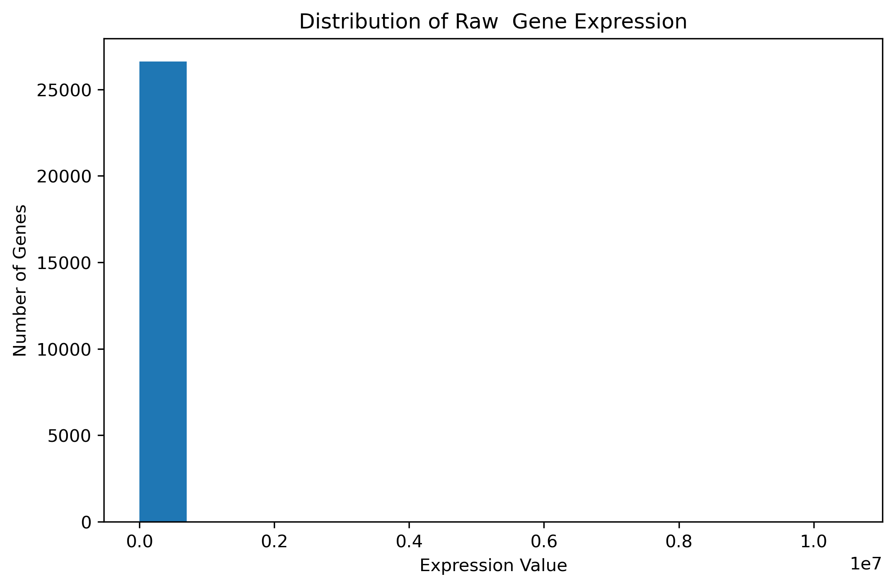
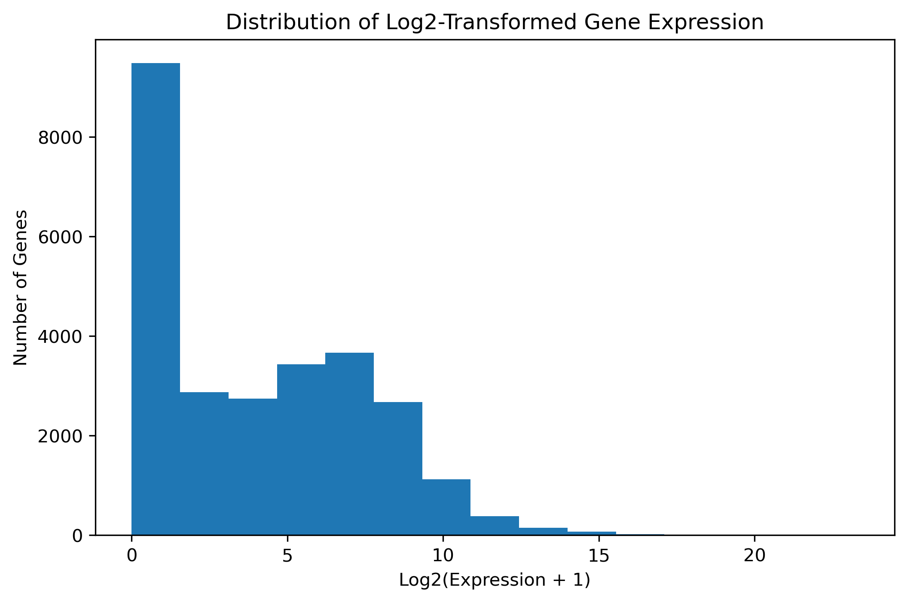
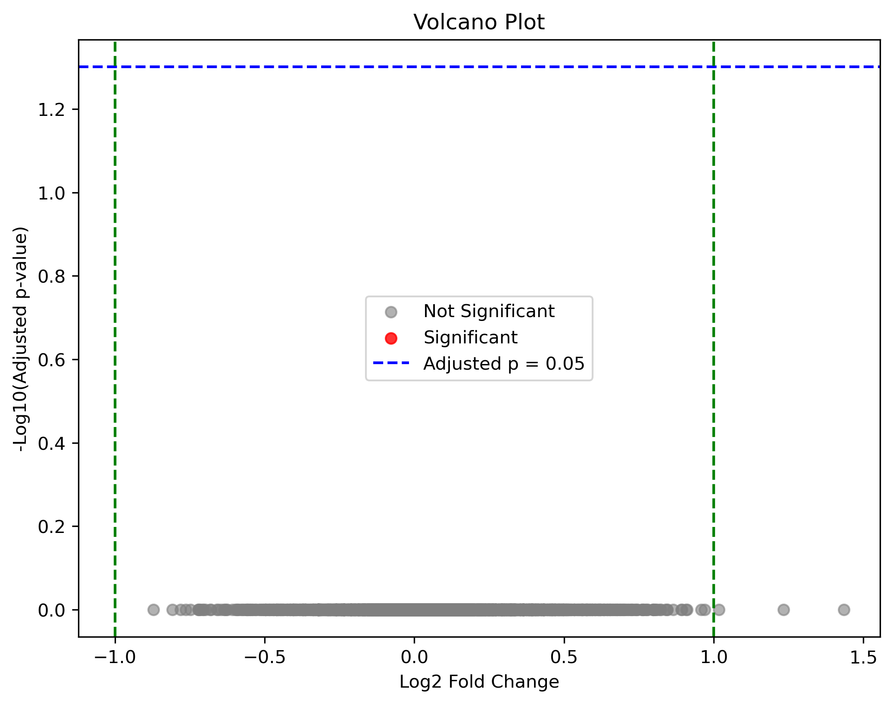

# RNA-Seq Differential Gene Expression Analysis Using Python

## Project Overview

This project demonstrates an end-to-end RNA-seq differential gene expression analysis workflow using Python. The analysis compares gene expression profiles between pancreatic islet samples from individuals with Type 2 Diabetes and non-diabetic controls. The workflow includes data preprocessing, exploratory data analysis (EDA), statistical hypothesis testing, multiple testing correction, log₂ fold change calculation, and volcano plot visualization.

**Note:** This project is intended for educational purposes to demonstrate the core concepts of differential gene expression analysis using Python. In production RNA-seq analyses, specialized tools such as **DESeq2**, **edgeR**, or **limma-voom** are generally preferred.

---

## Dataset

**Source:** Gene Expression Omnibus (GEO)

**Accession Number:** GSE86468

**Biological Samples:**
- Pancreatic islet samples
- Type 2 Diabetes patients
- Non-diabetic controls

---

## Research Question

**Which genes are differentially expressed between pancreatic islets from individuals with Type 2 Diabetes and non-diabetic controls?**

---

## Analysis Workflow

The following steps were performed:

1. Imported RNA-seq gene expression data
2. Performed exploratory data analysis (EDA)
3. Visualized raw gene expression distribution
4. Applied log₂ transformation
5. Compared diabetic and control groups
6. Performed Welch's t-test for each gene
7. Applied Benjamini–Hochberg (BH) multiple testing correction
8. Calculated log₂ fold change
9. Generated a volcano plot
10. Exported differential expression results

---

## Statistical Methods

### Welch's t-test
Used to compare the mean gene expression between diabetic and control samples.

### Benjamini–Hochberg (BH) Correction
Used to convert raw p-values into adjusted p-values (False Discovery Rate, FDR) to reduce false positive results caused by testing thousands of genes simultaneously.

### Significance Threshold

- Adjusted p-value < 0.05

---

## Results

- Differential expression analysis was completed successfully.
- Log₂ fold changes were calculated for every gene.
- Benjamini–Hochberg correction was applied to control the False Discovery Rate.
- Volcano plot visualization was generated.
- No genes remained statistically significant after FDR correction.

---

## Repository Structure

```
Differential-Gene-Expression-Python
│
├── data/
├── figures/
├── notebooks/
├── results/
└── README.md
```

---

## Figures

### Raw Gene Expression Distribution



---

### Log₂ Transformed Gene Expression Distribution



---

### Volcano Plot



---

## Technologies Used

- Python
- Jupyter Notebook
- NumPy
- pandas
- matplotlib
- SciPy
- statsmodels

---

## Key Bioinformatics Concepts Demonstrated

- RNA-seq data analysis
- Differential gene expression
- Exploratory data analysis (EDA)
- Log₂ transformation
- Hypothesis testing
- Welch's t-test
- Benjamini–Hochberg False Discovery Rate (FDR)
- Log₂ fold change
- Volcano plot visualization
- Scientific interpretation of results

---

## Future Improvements

Future versions of this project will include:

- Differential expression analysis using **DESeq2**
- Functional enrichment analysis (GO and KEGG)
- Heatmap visualization of significant genes
- Principal Component Analysis (PCA)
- RNA-seq analysis using raw FASTQ files
- Workflow automation with Nextflow

---

